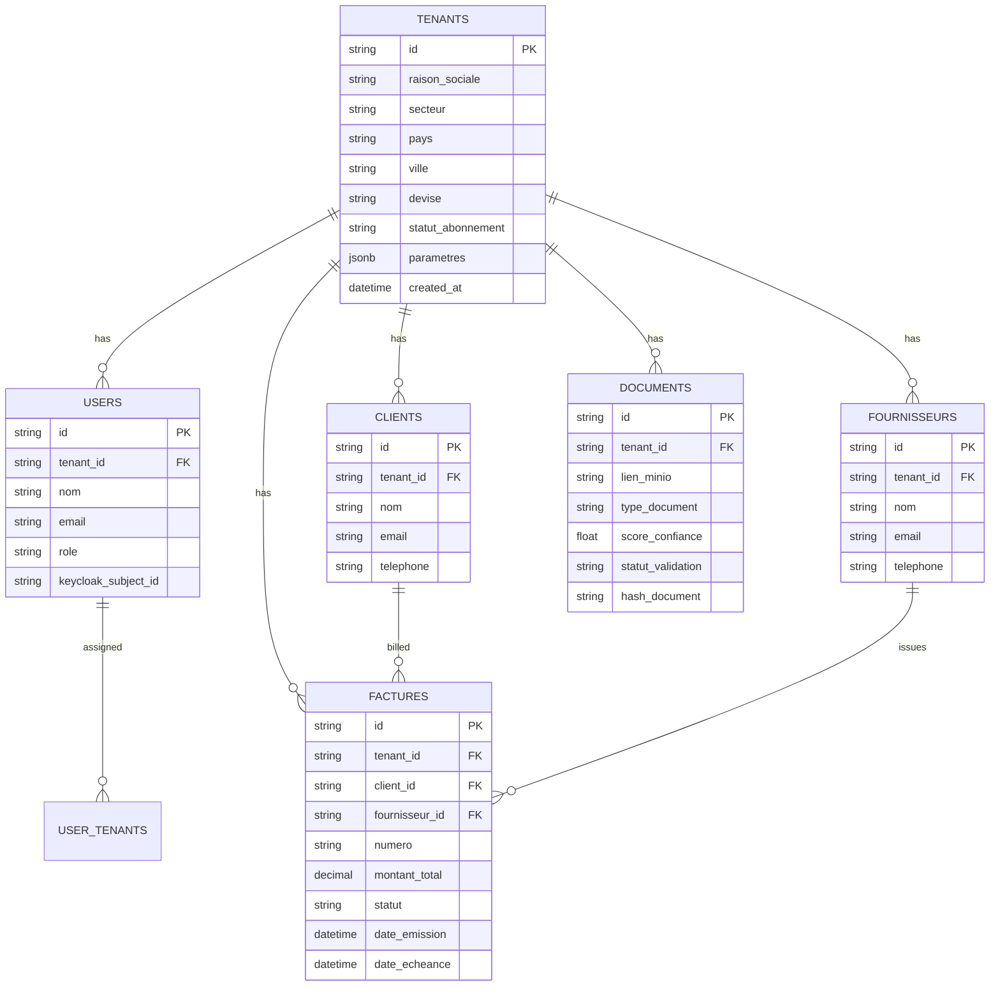

# Modèle de données ELARA (Business Memory)

Ce document décrit le schéma relationnel et la sécurité d'accès de la base de données ELARA.

## Sécurité des Données
1. **Multi-tenant** : Toute entité est liée à un `tenant_id`.
2. **Row Level Security (RLS)** : Les requêtes ne renvoient QUE les données du locataire courant via le contexte `app.current_tenant_id`.
3. **Traçabilité** : Triggers de modification automatiques et `audit_trail` pour le suivi des actions.

## Diagramme Entité-Relation (ERD)

